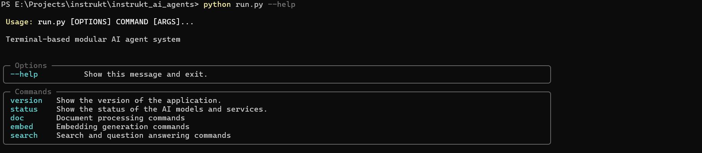
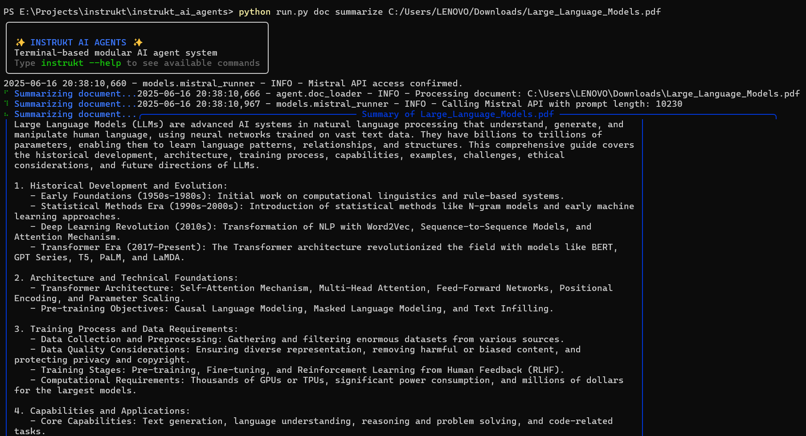
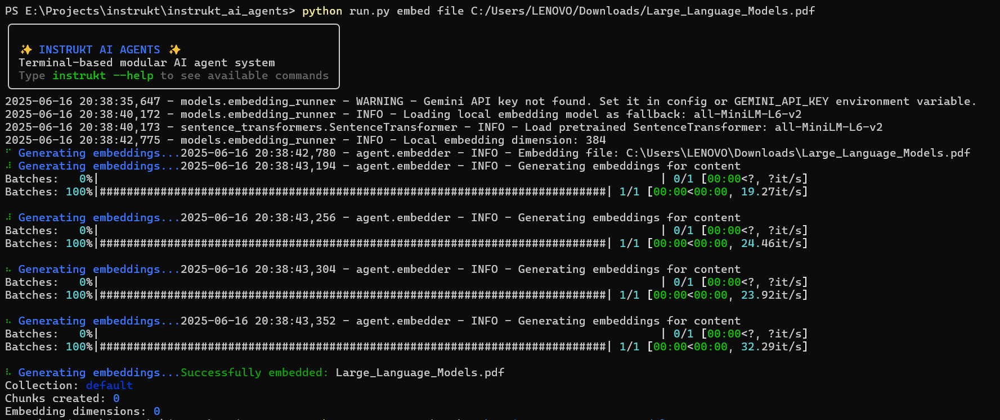
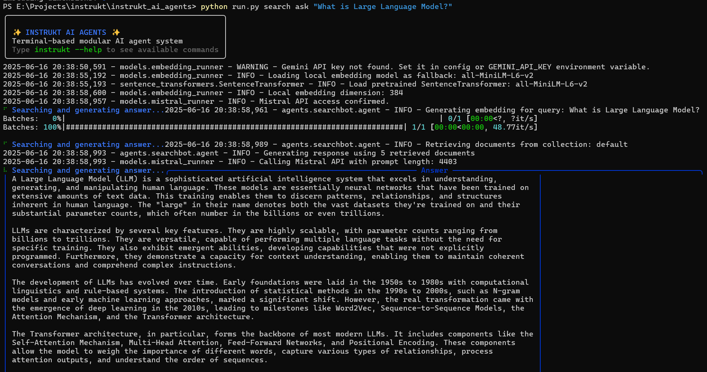

# Instrukt AI Agents

A modular terminal-based AI agent system for document processing, embedding generation, and semantic search.

## Features

- **Document Processing**: Summarize PDF, DOCX, TXT, and MD files using Mistral AI
- **Embedding Generation**: Create vector embeddings for documents using Google Gemini API
- **Semantic Search**: Ask questions about your documents using RAG (Retrieval-Augmented Generation)

## Prerequisites

- Python 3.8+
- API keys for the following services:
  - Mistral AI (for text generation)
  - Google Gemini API (for embeddings)

## Installation

1. Clone the repository
2. Navigate to the project directory
3. Install dependencies:

```bash
pip install -r requirements.txt
```


## API Keys Setup

This application requires API keys for various services. For security reasons, API keys should be set as environment variables rather than hardcoded in configuration files.

### Required Environment Variables

- `MISTRAL_API_KEY`: API key for Mistral AI services
- `GEMINI_API_KEY`: API key for Google Gemini API services

### Setting Environment Variables

#### Windows
```cmd
set MISTRAL_API_KEY=your_mistral_api_key
set GEMINI_API_KEY=your_gemini_api_key
```

#### Linux/macOS
```bash
export MISTRAL_API_KEY=your_mistral_api_key
export GEMINI_API_KEY=your_gemini_api_key
```

Alternatively, you can create a `.env` file in the project root and use a package like `python-dotenv` to load these variables.

## Usage

The application can be run using the `run.py` script or directly via the CLI.

### Using run.py

```bash
# Summarize a document
python run.py doc summarize path/to/document.pdf

# Generate embeddings for a document
python run.py embed file path/to/document.txt

# Ask a question about your documents
python run.py search ask "What is the main topic of my documents?"
```

### Using the CLI directly

```bash
# Show help
python -m cli.main --help

# Summarize a document
python -m cli.main doc summarize path/to/document.pdf

# Generate embeddings for a document
python -m cli.main embed file path/to/document.txt

# Ask a question about your documents
python -m cli.main search ask "What is the main topic of my documents?"
```

## Examples with Screenshots

### Main

Shows the fetaures 

### Document Summarization

Summarize documents with a single command, extracting the key information from PDFs, Word documents, and more.

### Embedding Generation

Generate vector embeddings for your documents to enable semantic search capabilities.

### Semantic Search

Ask natural language questions about your documents and get AI-powered answers based on the content.

## Configuration

The application's configuration is stored in `config/settings.yaml`. You can modify this file to change model parameters, but API keys should be set using environment variables for security.

## Dependencies

Key dependencies include:

- **typer**: Command-line interface
- **rich**: Terminal formatting
- **sentence-transformers**: Local embedding model (fallback)
- **requests**: API integration
- **PyPDF2, python-docx**: Document processing
- **chromadb**: Vector storage

See `requirements.txt` for the complete list.

## Troubleshooting

If you encounter issues:

1. Ensure all dependencies are installed: `pip install -r requirements.txt`
2. Verify API keys are correctly set as environment variables
3. Check the logs for detailed error messages
4. Make sure the local fallback models are working if API access fails
